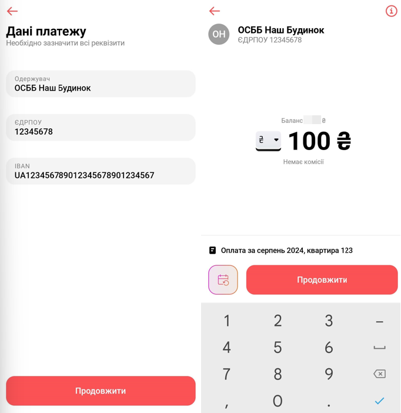

# Генератор платіжних QR-кодів

Цей невеликий проект призначений для генерації платіжних QR-кодів для українських банків. Він побудований з використанням бібліотеки `qrcode` згідно із Правилами формування та використання QR-коду
для здійснення кредитових переказів затвердженої Постановою Правління Національного банку України 28 травня 2020 року № 68 (у редакції постанови Правління
Національного банку України від 01 лютого 2021 року № 11)

## Вимоги

Docker

## Натхнення та призначення

Цей проект виник як результат дослідження можливості генерації зручних QR-кодів для платежів в Україні в процесі зборів ОСББ на генератор. Також ОСББ можуть використоуввати для формування QR-кодів для персоналізованих платіжнок чи будь-яких інших платежів.

## Використання

Запускається в докері з маппінгом вихідного каталогу на `/output`. Всі QR-коди будуть збережені в цьому каталозі. Зпустити можна без параметрів:
```
docker pull ghcr.io/yurnov/payment-qr-generator:latest
docker run -it --rm -v $(pwd):/output ghcr.io/yurnov/payment-qr-generator:latest
```

чи з параметрами:
```
docker run -it --rm -v $(pwd):/output ghcr.io/yurnov/payment-qr-generator:latest \
    --amount "UAH100.00" \
    --recipient "ОСББ Наш Будинок" \
    --account "UA123456789012345678901234567" \
    --edrpo "12345678" \
    --purpose "Оплата за серпень 2024, квартира 123"
```

В результаті буде сфорований файл з QR-кодом, при скануванні якого на телефоні користувача відкриється додаток банку з заповненими даними.

Приклад:



## Перестороги

Це персональний проект, коректна робота не гаратується

## License

Files included in this repository is avaliable under terms of [MIT license](LICENSE).
